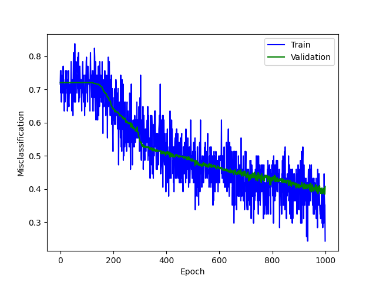
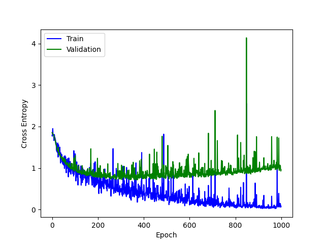
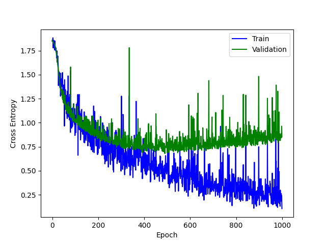

\newpage

# Q1

## 1.1

### A

$L(w,b,\xi,\alpha,r)=\frac{1}{2}||w||_2^2-\sum^N_{i=1}\alpha_i[t_i(w^Tx_i+b)-1]$

### B

$\frac{\partial L}{\partial w}=(\frac{1}{2}||w||_2^2)'-\sum^N_{i=1}\alpha_i[t_i(x_i*1+0)-0]=0\rightarrow w=\sum^N_{i=1}\alpha_it_ix_i$

$\frac{\partial L}{\partial b}=0-\sum^N_{i=1}\alpha_i[t_i(0+1)-0]=0\rightarrow \sum^N_{i=1}\alpha_it_i=0$

substitute the above two derivatives into lagrangian

$L(w,b,\xi,\alpha,r)=\frac{1}{2}||w||_2^2-\sum^N_{i=1}\alpha_i[t_i(w^Tx_i+b)-1]=\frac{1}{2}(\sum^N_{i=1}\alpha_it_ix_i)^2-\sum^N_{i=1}(\alpha_it_iw^Tx_i+\alpha_it_ib-\alpha_i)$

$=\frac{1}{2}\sum^N_{i=1}\sum^N_{j=1}\alpha_it_ix_i\alpha_jt_jx_j-(\sum^N_{i=1}\alpha_it_iw^Tx_i+b\sum^N_{i=1}\alpha_it_i-\sum^N_{i=1}\alpha_i)$

$=\frac{1}{2}\sum^N_{i=1}\sum^N_{j=1}\alpha_i\alpha_jt_it_jx_ix_j-\sum^N_{i=1}(\alpha_it_iw^Tx_i-b\times0)+\sum^N_{i=1}\alpha_i$

and we have $\sum^N_{i=1}\alpha_it_iw^Tx_i=\sum^N_{i=1}[\alpha_it_i\sum^N_{j=1}((a_jt_jx_j)x_i)]=\sum^N_{j=1}\alpha_i\alpha_jt_it_jx_ix_j$

therefore, $L(w,b,\xi,\alpha,r)=(\frac{1}{2}-1)\sum^N_{i=1}\sum^N_{j=1}\alpha_i\alpha_jt_it_jx_ix_j+\sum^N_{i=1}\alpha_i=\sum^N_{i=1}\alpha_i-\frac{1}{2}\sum^N_{i=1}\sum^N_{j=1}\alpha_i\alpha_jt_it_jx_ix_j$ s.t. $\sum^N_{i=1}\alpha_it_i=0\text{(given by}\frac{\partial L}{\partial b}\text{) and }0\leq\alpha_i$(KKT condition)

### C

Given $\alpha_i$ solved. We have $w=\sum^N_{i=1}\alpha_it_ix_i$ where $t_i$ and $x_i$ have already been given by data points. Then we can predict class of a new sample $(y_{pred},z)$(use (y,z) to distinguish from training sample (t,x), z is actually x in question) by $y_{pred}=\text{sign}(w^Tx+b)=\text{sign}((\sum^N_{i=1}\alpha_it_ix_i)z+b)$. 

$b$ is calculated based on support vector that lies on margin, which means we have $t_i(w^Tx+b)=1$. And we know $t_i^2=1$(because of {-1,+1} coding), then $t_i(w^Tx+b)=t_i^2\rightarrow w^Tx+b=t_i$, then $b$  can be obtained by $b=t_i-w^Tx$ where $(t_i,x_i)$ are given by training dataset.

## 1.2

### A

Lagrangian as given in lecture:

$L(w,b,\xi,\alpha,r)=\frac{1}{2}||w||_2^2+\gamma\sum^N_{i=1}\xi_i-\sum^N_{i=1}\alpha_i[t_i(w^Tx_i+b)-1+\xi_i]-\sum^N_{i=1}\beta_i\xi_i$

take derivative

$\frac{\partial L}{\partial w}=(\frac{1}{2}||w||_2^2)'+0-\sum^N_{i=1}\alpha_i[t_i(x_i*1+0)-0]-0=0\rightarrow w=\sum^N_{i=1}\alpha_it_ix_i$

$\frac{\partial L}{\partial b}=0+0-\sum^N_{i=1}\alpha_i[t_i(0+1)-0]-0=0\rightarrow \sum^N_{i=1}\alpha_it_i=0$

$\frac{\partial L}{\partial \xi_i}=0+\gamma\sum^N_{i=1}1-\sum^N_{i=1}\alpha_i\times1-\sum^N_{i=1}\beta_i\times1=0\rightarrow \gamma-\alpha_i-\beta_i=0$(PRML p.333 formula7.31)

substitute the above derivatives into lagrangian, 

$L(w,b,\xi,\alpha,r)=\frac{1}{2}(\sum^N_{i=1}\alpha_it_ix_i)^2+\gamma\sum^N_{i=1}\xi_i-\sum^N_{i=1}(\alpha_it_iw^Tx_i+\alpha_it_ib-\alpha_i+\alpha_i\xi_i)-\sum^N_{i=1}\beta_i\xi_i$

$=\frac{1}{2}(\sum^N_{i=1}\alpha_it_ix_i)^2-\sum^N_{i=1}(\alpha_it_iw^Tx_i+\alpha_it_ib-\alpha_i)+(\gamma\sum^N_{i=1}\xi_i-\sum^N_{i=1}\alpha_i\xi_i-\sum^N_{i=1}\beta_i\xi_i)$

$=\frac{1}{2}\sum^N_{i=1}\sum^N_{j=1}\alpha_i\alpha_jt_it_jx_ix_j-\sum^N_{i=1}(\alpha_it_iw^Tx_i-b\times0)+\sum^N_{i=1}\alpha_i+(\gamma\sum^N_{i=1}\xi_i-\sum^N_{i=1}\alpha_i\xi_i-\sum^N_{i=1}\beta_i\xi_i)$

and we have $\sum^N_{i=1}\alpha_it_iw^Tx_i=\sum^N_{i=1}[\alpha_it_i\sum^N_{j=1}((a_jt_jx_j)x_i)]=\sum^N_{j=1}\alpha_i\alpha_jt_it_jx_ix_j$

then $L(w,b,\xi,\alpha,r)=\sum^N_{i=1}\alpha_i-\frac{1}{2}\sum^N_{i=1}\sum^N_{j=1}\alpha_i\alpha_jt_it_jx_ix_j+(\gamma\sum^N_{i=1}\xi_i-\sum^N_{i=1}\alpha_i\xi_i-\sum^N_{i=1}\beta_i\xi_i)$

$=\sum^N_{i=1}\alpha_i-\frac{1}{2}\sum^N_{i=1}\sum^N_{j=1}\alpha_i\alpha_jt_it_jx_ix_j+[\sum^N_{i=1}(\gamma-\alpha_i-\beta_i)\xi_i]$

Recall $\gamma-\alpha_i-\beta_i=0$

therefore, $L(w,b,\xi,\alpha,r)=(\frac{1}{2}-1)\sum^N_{i=1}\sum^N_{j=1}\alpha_i\alpha_jt_it_jx_ix_j+\sum^N_{i=1}\alpha_i=\sum^N_{i=1}\alpha_i-\frac{1}{2}\sum^N_{i=1}\sum^N_{j=1}\alpha_i\alpha_jt_it_jx_ix_j$ s.t. $\sum^N_{i=1}\alpha_it_i=0\text{(given by}\frac{\partial L}{\partial b}\text{) and }0\leq\alpha_i\leq\gamma$(KKT condition)

### B

Given $\alpha_i$ solved. We have $w=\sum^N_{i=1}\alpha_it_ix_i$ where $t_i$ and $x_i$ have already been given by data points. Then we can predict class of a new sample $(y_{pred},z)$(use (y,z) to distinguish from training sample (t,x), z is actually x in question) by $y_{pred}=\text{sign}(w^Tx+b)=\text{sign}((\sum^N_{i=1}\alpha_it_ix_i)z+b)$. 

$b$ is calculated based on support vector that lies on margin, which means we have $t_i(w^Tx+b)=1$. And we know $t_i^2=1$(because of {-1,+1} coding), then $t_i(w^Tx+b)=t_i^2\rightarrow w^Tx+b=t_i$, then $b$  can be obtained by $b=t_i-w^Tx$ where $(t_i,x_i)$ are given by training dataset.

\newpage

# 2

## 2.1 

See attached code

## 2.2

CE: Train 0.33681 Validation 0.96455 Test 0.91351
Acc: Train 0.86781 Validation 0.75179 Test 0.73247

Within each epoch training error bounce back and forth around some value. Between each epoch, training error and validation error decrease as iteration goes further. Error rate between epoch also bounce back and fourth, but the overall trend is decreasing. Rate of validation error change is getting smaller faster rate of than training error change, as iteration goes. At the end, training error is smaller than valdiation error.

## 2.3

### change $\eta$

#### $\eta=0.0001$

CE: Train 1.08364 Validation 1.10539 Test 1.13140
Acc: Train 0.61263 Validation 0.59189 Test 0.56883

#### $\eta=0.5$

CE: Train 1.86108 Validation 1.85905 Test 1.83904
Acc: Train 0.28542 Validation 0.27924 Test 0.31688

When $\eta$(learing rate) is too small, like 0.0001, the algorithm will converge, but it is much slower and require much more iterations to converge. when $\eta$(learing rate) is too large, like 0.5, the algorithm cannot converge.

### Change Batch size

#### $batchsize=10$

CE: Train 0.00598 Validation 2.34147 Test 1.59238
Acc: Train 0.99970 Validation 0.73270 Test 0.77662

#### $batchsize=1000$

CE: Train 1.02165 Validation 1.04536 Test 1.04790
Acc: Train 0.62241 Validation 0.60143 Test 0.60519

With a small batch size, like 10, algorithm converge fast in terms of number of iterations, but each iteration will take longer. With a large batch size, like 1000, algorithm converge slower in terms of number of iterations, but each iteration will be faster.

I would stick to the original $\eta=0.01$ and batch size=100. For $\eta$, first we want the algorithm to converge, so we can't pick a large $\eta$, like 0.5, but also we want the algorithm to be efficient, so we can't have a very small $\eta$,like 0.0001. For batch size, all batch size will converge, but for large batch size, like 1000, it's slow. For small batch size, like 10, we reach convergence in early iterations, and further iterations become waste of time, it requries more effort on choice of number of epoch. Therefore, stick to the original $\eta=0.01$ and batch size=100.

## 2.4

### [2,32]

CE: Train 0.88481 Validation 1.10345 Test 1.11113
Acc: Train 0.67872 Validation 0.60859 Test 0.61299

### [20.32]

CE: Train 0.17950 Validation 0.82381 Test 0.72161
Acc: Train 0.94784 Validation 0.75656 Test 0.77922

### [80,32]

CE: Train 0.09553 Validation 0.95989 Test 0.89160
Acc: Train 0.97629 Validation 0.75179 Test 0.75584

### [16,2]

CE: Train 0.77167 Validation 1.31170 Test 1.21029
Acc: Train 0.69887 Validation 0.61337 Test 0.61558

### [16,20]

CE: Train 0.37221 Validation 1.02247 Test 0.82904
Acc: Train 0.86011 Validation 0.73986 Test 0.72208

### [16,80]

CE: Train 0.18766 Validation 0.85490 Test 0.77143
Acc: Train 0.94161 Validation 0.74940 Test 0.75325

For the experiment set of hyperparameters, if the set involve $2([16,2]\text{ and }[2,32])$, which is a very small number. the algorithm will converge slower. Among the rest 4 experimental hyperparameter sets$([16,20],[16,80],[20,32],[80,32])$, there is no clear differences, but they are faster and produce better accuracy compare to the first two experimental sets. So performance and complexity of algorithm may increase as number of hyperparameters increase, but this increasing effect on performance will fade as number of hyperparameters keeps going larger.

## 2.5

I believe I got how to do the question and include it in the main() function as a chunk, labeled as "for last question 2.5", but don't know how to plot, so there is no output. Will there be partial marks?

